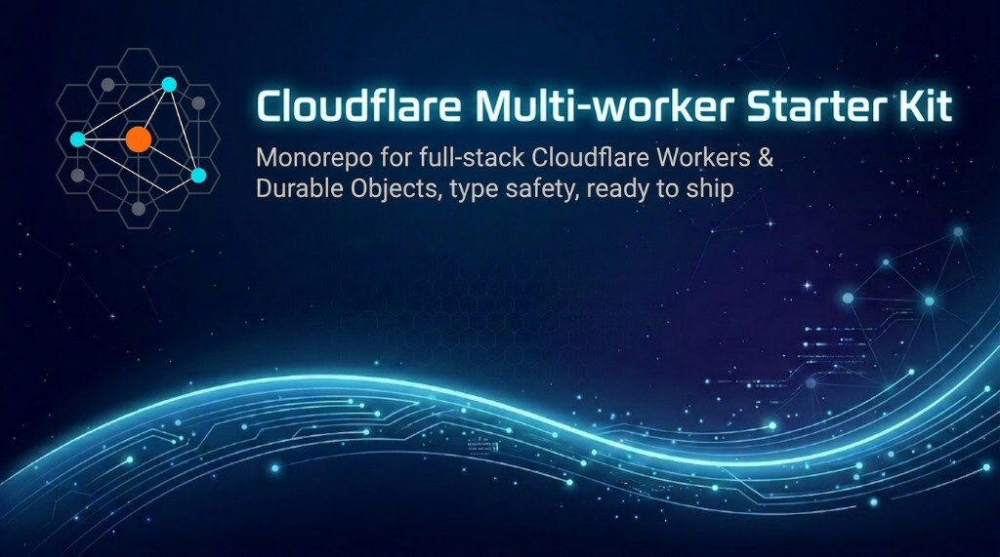

# Cloudflare Multi-Worker Starter Kit

[](https://github.com/firtoz/cf-multiworker-starter-kit/generate)
[](https://github.com/firtoz/cf-multiworker-starter-kit/blob/main/README.md#license)

[](https://www.typescriptlang.org/)
[](https://developers.cloudflare.com/workers/)
[](https://developers.cloudflare.com/durable-objects/)
[](https://turbo.build/)
[](https://reactrouter.com/)
[](https://bun.sh/)
[](https://hono.dev/)



Production-proven Turborepo monorepo starter kit for full-stack Cloudflare Workers apps — Durable Objects, end-to-end type safety, and a battle-tested deploy pipeline.

**Why this repo exists:** I ship several new projects a week and use this starter as my default stack—it keeps changing when real work surfaces gaps (env flows, deploy safety, typegen, monorepo ergonomics). If it saves you setup time, use it as a template or fork; if you want to tighten patterns for everyone, issues and pull requests are welcome—see [CONTRIBUTING.md](CONTRIBUTING.md).

## Why Use This?

Building on Cloudflare's edge platform is powerful but complex. This starter kit solves the hard parts so you can focus on your app:

- **Type Safety Across Workers**: Automatic type generation for Durable Object bindings - call DOs from any worker with full IntelliSense
- **Modern React Stack**: React Router 7 with streaming SSR, form actions, and optimized CSS loading via 103 Early Hints
- **End-to-End Validation**: Type-safe API calls using Hono + hono-fetcher with Zod validation
- **Ready to Deploy**: Turborepo tasks for local vs prod typegen/wrangler, **dry-run deploy** vs **live deploy**, and aggressive caching (only `dev` and `clean` skip the Turbo cache)

**What's included:**
- React Router 7 web app with TailwindCSS
- Multiple Durable Object examples with different communication patterns (direct RPC)
- Turborepo generator to scaffold new Durable Objects
- Automatic type imports via unified cf-typegen script

## Quick Start

### Use This Template

**Option 1 - GitHub UI:**
1. Open [https://github.com/firtoz/cf-multiworker-starter-kit](https://github.com/firtoz/cf-multiworker-starter-kit)
2. Click "Use this template" → "Create a new repository"

**Option 2 - GitHub CLI:**
```bash
gh repo create my-project --template firtoz/cf-multiworker-starter-kit --public
cd my-project
```

### Install & run

```bash
bun install

# Interactive .env.local (prompts for SESSION_SECRET, optional Cloudflare token/account; won't overwrite unless --force)
bun run setup

# Dev (Turbo runs typegen → wrangler generate → Vite; first run can take a minute)
bun run dev
```

Open the URL Vite prints (usually `http://localhost:5173`; if that port is busy it picks the next, e.g. `5174`)

### Production deploy (first time)

1. **`bun run setup:prod`** — Interactive wizard for repo-root **`.env.production`** (**SESSION_SECRET** required; **`CLOUDFLARE_*`** optional if you use **`bunx wrangler login`**; optional ROUTES / zone and worker names). Same UX as **`bun run setup`**; **`--yes`** / **`--force`** behave like local setup (non-interactive vs full replace).
2. **`bun run check-prod-env`** — Confirms `.env.production` exists (this also runs automatically at the start of **`deploy`** / **`deploy:execute`**).
3. **`bun run deploy`** — Wrangler **dry-run** only (safe). **`bun run deploy:execute`** — Full live pipeline (secret sync, queues, builds, `wrangler deploy`).

**Flags:** **`bun run setup --yes`** skips prompts (generates **`SESSION_SECRET`**; optional keys follow non-interactive defaults — use when stdin is not a TTY). If **`.env.local` already exists** and you run **`setup` interactively**, you get a **summary** and can **update one section** (secret, Cloudflare, worker names) or re-run the full wizard. **`bun run setup --force`** replaces the file (after confirm in a TTY; **`--yes --force`** for scripts). **Before deploy:** run **`setup:prod`** and use **`bunx wrangler login`** for CLI auth, or add **`CLOUDFLARE_*`** to **`.env.production`** when you need API tokens in the file (e.g. CI).

**After forking:** **`bun run setup`** can set a **prefix for local Wrangler worker script names** (the `*-dev` workers). For production names, `package.json` names, README/UI, and a full rebrand, see [.cursor/skills/project-init/SKILL.md](.cursor/skills/project-init/SKILL.md).

### Conventions (humans & AI coding agents)

Skim [AGENTS.md](AGENTS.md) at the repo root. In short:

- **Cloudflare `env`:** `import { env } from "cloudflare:workers";` — do not use React Router context (e.g. `context.cloudflare.env`) for bindings.
- **New routes:** register in `apps/web/app/routes.ts`, run `bun run typegen`, and in each route module export `route` with `RoutePath<"...">` from `@firtoz/router-toolkit` (see `apps/web/app/routes/home.tsx`).
- **While building:** run `bun run typegen`, `bun run typecheck`, and `bun run lint` from the repo root whenever you change routes, wrangler, or env — not only at the end.
- **Loaders / actions:** prefer `Promise<MaybeError<...>>` with `success` / `fail` so UI and submitters narrow cleanly (see `apps/web/app/routes/home.tsx`).

## Project Structure

```
├── apps/
│   └── web/                    # React Router 7 app
│       ├── app/routes/         # Routes (home.tsx, ...)
│       └── workers/app.ts      # Cloudflare Worker entry point
├── durable-objects/
│   ├── coordinator-do/         # Orchestrates work across workers
│   ├── processor-do/           # Processes work items
│   └── example-do/             # Minimal DO example
└── packages/
    ├── do-common/              # Shared types & Zod schemas
    └── scripts/                # Shared tooling
        ├── src/cf-typegen.ts   # Wrangler types across workspace packages
        ├── src/bootstrap-env-prod.ts   # bun run setup:prod → .env.production
        ├── src/check-prod-deploy-prereqs.ts  # bun run check-prod-env, also gate for deploy / deploy:execute
        ├── src/load-env-production.ts      # Prod env loader (sync-secrets, pre-deploy)
        ├── src/pre-deploy.ts   # Queue ensure + checks (used by deploy:execute)
        ├── src/utils/generate-wrangler.ts  # wrangler.jsonc.hbs → wrangler-dev | wrangler-prod
        └── src/wrangler-dry-run-prod.ts    # wrangler deploy --dry-run (used by deploy)
```

For deeper conventions (env files, `^task` dependencies, caching), see **[AGENTS.md](AGENTS.md)** and [.cursor/skills/turborepo/SKILL.md](.cursor/skills/turborepo/SKILL.md).

## Key Features

### 1. Type-Safe Durable Object Calls

The `cf-typegen` script automatically runs wrangler types and converts DO type comments into proper imports:

```typescript
// After running cf-typegen, you get full types:
const coordinator = env.CoordinatorDo.getByName("main");
const api = honoDoFetcherWithName(env.CoordinatorDo, "main");
const response = await api.get({ url: "/status" }); // ✅ Typed!
```

### 2. Add New Durable Objects Easily

```bash
bunx turbo gen durable-object
# Follow prompts, then implement logic in workers/app.ts
```

## Configuration

### Environment variables

- **`.env.example`** (committed) — **Documentation** for humans/agents only; **not read** by setup, Wrangler, or builds. Use real env files below.
- **`.env.local`** (gitignored) — Local dev, `cf-typegen`, and `bun --env-file` for builds.
- **`.env.production`** (gitignored) — Production deploy: create with **`bun run setup:prod`**. `generate-wrangler --mode=remote` merges deployment keys from repo-root `.env.production` (see `getDeploymentKeys` in `packages/scripts/src/utils/workspace-worker-catalog.ts`: `ROUTES`, `ROUTES_ZONE_NAME`, and each `*_WORKER_NAME` discovered from `wrangler.jsonc.hbs` under `apps/` and `durable-objects/`), plus any extra `*_WORKER_NAME` lines, onto `process.env` — not the whole file dumped blindly.

Minimal root `.env.local` (only **`SESSION_SECRET`** is required for local web sessions; omit **`CLOUDFLARE_*`** if you use **`bunx wrangler login`**). Create it with **`bun run setup`** (generates **`SESSION_SECRET`**) or add **`SESSION_SECRET`** yourself (strong random string, min 16 characters).

```bash
# CLOUDFLARE_API_TOKEN=
# CLOUDFLARE_ACCOUNT_ID=
```

### Wrangler config (templates + generated JSONC)

Each app/DO package keeps a committed **`wrangler.jsonc.hbs`**. Generated files **`wrangler-dev.jsonc`** and **`wrangler-prod.jsonc`** are **gitignored** — produce them with `bun run typegen` (or per-package `generate-wrangler:local` / `:prod`). Do not hand-edit the generated JSONC.

To bind a Durable Object from another worker, use `script_name` in the template (see `durable-objects/*/wrangler.jsonc.hbs` and `apps/web/wrangler.jsonc.hbs`). Default worker names use a `*-dev` suffix locally and non-suffixed names for prod unless you override in `.env.local` / `.env.production` / CI.

Then run **`bun run typegen`** from the repo root so `worker-configuration.d.ts` stays in sync everywhere.

## Continuous Integration

[`.github/workflows/ci.yml`](.github/workflows/ci.yml) runs on pushes and PRs to **`main`**:

1. **Lint** — `bun run lint` (Biome)
2. **Typecheck** — `bun run typegen` then `bun run typecheck`
3. **Build** — `bun run build`

Uses Bun with a frozen lockfile and Turborepo for parallel/cached tasks.

## Deployment

### Prerequisites

1. **API token** — https://dash.cloudflare.com/profile/api-tokens → **Edit Cloudflare Workers** (or equivalent: Workers Scripts, Workers Routes, Observability).
2. **Root env** — For local CLI / `wrangler dev`, use **`.env.local`** (see **`bun run setup`**). For **`deploy`** / **`deploy:execute`**, you need repo-root **`.env.production`** — run **`bun run setup:prod`** or create/edit the file by hand (see **`.env.example`** as a variable checklist). See [AGENTS.md](AGENTS.md).

### Two commands: dry-run vs live

| Command | What it does |
|--------|----------------|
| **`bun run deploy`** | Runs **`check-prod-env`** first, then after **`cf-starter-web#build:prod`**, runs **`wrangler deploy --dry-run`** for each DO (`wrangler-prod.jsonc`) and the web app (`build/server/wrangler.json`). **No uploads**, no queue creation. |
| **`bun run deploy:execute`** | Runs **`check-prod-env`**, then **`sync-secrets:prod`**, **`pre-deploy`** (queues + validate consumers), **`build:prod`**, **live `wrangler deploy`** for workspace DOs (each DO package uses **`deploy-cyclic-cross-worker.ts`**: dry-run both sides of a 2-node `script_name` cycle; **sacred** path = one deploy per worker; else **phased** from the **pipeline primary** — default = lexicographically larger Worker name, overridable with **`PIPELINE_PRIMARY_SCRIPT`**), then deploys the web worker from the production build. |

Use **`deploy`** in CI or locally to verify bundles/config without changing Cloudflare state. Use **`deploy:execute`** when you intend to ship.

### What `deploy:execute` runs (in order)

Root **`package.json`** runs **`check-prod-env`** before Turbo. Then Turbo runs the live pipeline:

1. **`generate-wrangler:prod`** — Writes **`wrangler-prod.jsonc`** for each app/DO (from templates + `.env.production`). Required input for secrets and deploys.
2. **`sync-secrets:prod`** — Reads `secrets.required` in each generated prod config and runs **`wrangler secret put`** for values present in **`.env.production`** (with a local hash cache in **`.wrangler-secret-sync.json`**; use the script’s **`--force`** flag to push every secret). See `packages/scripts/src/sync-wrangler-secrets.ts`.
3. **`pre-deploy`** — Scans wrangler configs for **queue** names; lists queues with **`wrangler queues list`**, creates missing ones with **`wrangler queues create`**, then **validates queue consumer** settings (e.g. `max_batch_timeout` minimums). It logs cyclic cross-worker **`script_name`** Durable Object graphs via **`bootstrapCircularCrossScriptDOBindings`** (`packages/scripts/src/utils/worker-script-cycle-bootstrap.ts`). **`deploy-cyclic-cross-worker.ts`** (each DO **`deploy`**) decides phased vs single deploy using **`wrangler deploy --dry-run`** on both scripts in a 2-node cycle. See `packages/scripts/src/pre-deploy.ts`.
4. **`build:prod`** — Production build for **`cf-starter-web`** (React Router / server bundle).
5. **Live `wrangler deploy` for each Worker** — Turbo runs **`deploy`** on workspace packages **before** the web app’s **`deploy:execute`**. **`durable-objects/*`** use **`deploy-cyclic-cross-worker.ts`** (no-op skip for the non-primary side only when a **phased** run is required). Keep **`coordinator-do#deploy`** **`dependsOn`** **`processor-do#deploy`** so the default pipeline primary (lexicographically larger Worker name, usually **processor**) runs first. **`bun run --cwd packages/scripts cyclic-do-status`** prints JSON health for all 2-node cycles. Finally **`cf-starter-web`** deploys the edge + SSR worker from **`build/server/wrangler.json`**.

Together, this keeps **queues**, **secrets**, and **workers** aligned so deploys succeed without hand-ordering steps.

**Turbo tip:** Most tasks are cached when inputs are unchanged. Only **`dev`** and **`clean`** always skip cache. To force a fresh run (e.g. redeploy same tree), use `turbo run deploy:execute --filter=cf-starter-web --force`.

## Scripts

### Development
- `bun run dev` — Dev servers (Turbo; **`cache: false`**, long-running)
- `bun run build` — `turbo run build:local`
- `bun run typecheck` — `typecheck:local` across packages
- `bun run typecheck:prod` — Prod-shaped types/config
- `bun run typegen` / `typegen:local` — Generate Wrangler types + React Router route types
- `bun run typegen:prod` — Prod wrangler inputs + types
- `bun run lint` — Biome (`check --write`)

### Deployment
- `bun run setup:prod` — Interactive **`.env.production`** (prod deploy prerequisite)
- `bun run check-prod-env` — Fail fast if `.env.production` is missing
- `bun run deploy` — **Dry-run only** (see table above)
- `bun run deploy:execute` — **Live** deploy pipeline

### Dependency management
- `bun run outdated` — Outdated deps across workspaces (includes **Wrangler** via the workspace catalog)
- `bun update wrangler` — From the **repo root**, bumps **Wrangler** to the newest version allowed by **`workspaces.catalog.wrangler`** in root **`package.json`**; **`bun.lock`** pins the exact release. **`packages/scripts`** also depends on **`wrangler`** (same catalog) so **`bunx wrangler`** in **`pre-deploy`** and other scripts uses that install instead of an older **`bunx`** cache
- `bun run update:interactive` — Interactive updates
- `bun run clean` — Remove `node_modules` and build artifacts (**Turbo `clean`**)

### Code generation
- `bunx turbo gen durable-object` — Scaffold a new Durable Object package

## Best Practices & Optimizations

This starter kit follows modern 2026 best practices:

### Type safety
- **Shared TypeScript config**: `tsconfig.base.json` across packages
- **Strict TypeScript**: Additional checks where enabled (`noUncheckedIndexedAccess`, etc.)
- **Automatic generation**: `worker-configuration.d.ts` from Wrangler; React Router types under `.react-router/` (gitignored)

### Code quality
- **Biome** for lint + format
- **Turborepo**: Declared `inputs` / `outputs` / `env` so unchanged work **hits the cache** on repeat runs (except `dev` and `clean`)

### Git hooks
If you use pre-commit hooks in your fork, wire them to `bun run lint` / `typecheck` as you prefer — this template does not enforce a specific hook framework.

### Performance
- **103 Early Hints**: CSS preloading for faster initial page loads
- **Smart Placement**: Workers automatically deployed to optimal global locations
- **Aggressive Code Splitting**: Vendor chunks split for better caching
- **Streaming SSR**: React Router 7 streams HTML for faster TTFB

### Dependency management
- **Lock file**: `bun.lock` for reproducible installs
- Optional: add Renovate or Dependabot in your fork for automated bumps

### Observability
- **Cloudflare Logs**: Enabled for all workers and DOs
- **CPU Limits**: Configured to catch runaway executions early
- **Observability Dashboard**: View real-time metrics in Cloudflare dashboard

## Technologies

- **[Cloudflare Workers](https://workers.cloudflare.com/)** - Edge runtime
- **[Durable Objects](https://developers.cloudflare.com/durable-objects/)** - Stateful serverless
- **[React Router 7](https://reactrouter.com/)** - Full-stack React framework
- **[Hono](https://hono.dev/)** - Fast web framework for Workers
- **[@firtoz/hono-fetcher](https://www.npmjs.com/package/@firtoz/hono-fetcher)** - Type-safe DO API client
- **[Zod](https://zod.dev/)** - Schema validation
- **[Turborepo](https://turbo.build/repo)** - Monorepo build system
- **[Biome](https://biomejs.dev/)** - Fast linter & formatter
- **[Bun](https://bun.sh/)** - Fast package manager & runtime

## Contributing

Bug reports, doc fixes, and improvements that keep the template honest for day-to-day use are welcome. See [CONTRIBUTING.md](CONTRIBUTING.md) for setup and quality checks before you open a PR.

## License

MIT
